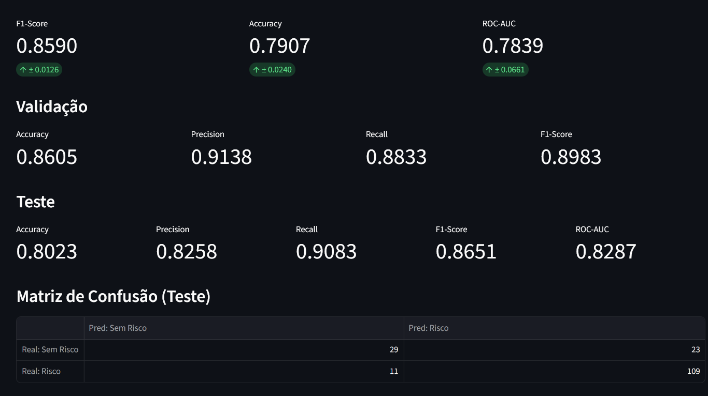
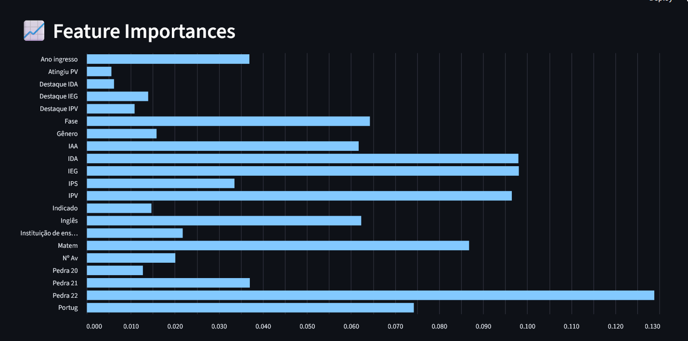
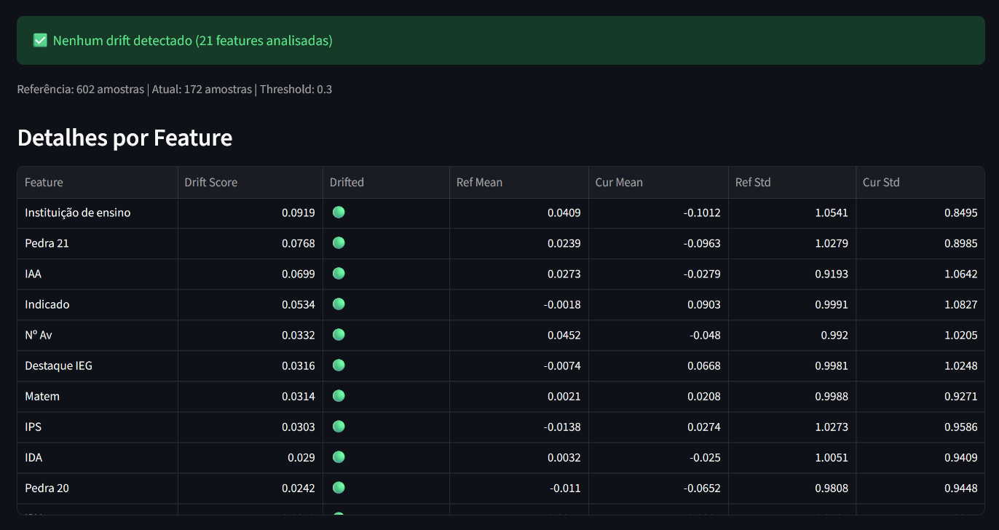
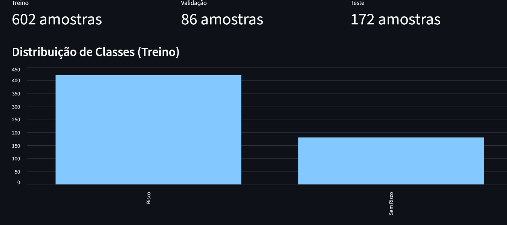
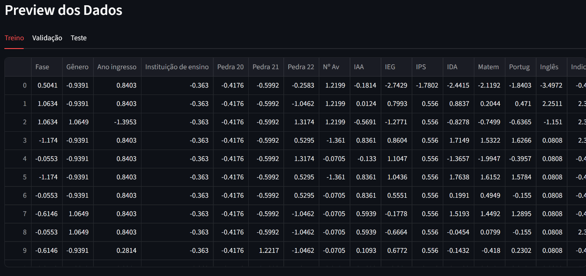

# 🎓 Passos Mágicos — Predição de Risco de Defasagem Escolar

Projeto de Machine Learning desenvolvido para o **Datathon FIAP** em parceria com a **Associação Passos Mágicos**. O modelo identifica estudantes em risco de defasagem escolar, permitindo intervenções proativas pela equipe pedagógica.

## 🔗 Links

| | Link |
|---|---|
| **Código-fonte (GitHub)** | https://github.com/RVerdiF/datathon |
| **API em produção (Render)** | https://datathon-hj9j.onrender.com/ |
| **Monitoramento de uptime** | https://stats.uptimerobot.com/bviadalixD |

## 📋 Visão Geral

| Item | Detalhes |
|------|----------|
| **Problema** | Classificação binária — Risco vs Sem Risco de defasagem escolar |
| **Modelo** | Random Forest (melhor F1-Score) |
| **F1-Score (teste)** | 0.865 |
| **ROC-AUC (teste)** | 0.829 |
| **Cobertura de testes** | 93% |
| **API** | FastAPI + Swagger docs |

## 🏗️ Arquitetura

```
datathon/
├── api/                        # API FastAPI
│   ├── main.py                 # App principal e health check
│   ├── schemas.py              # Modelos Pydantic
│   └── routers/
│       └── predict.py          # Endpoints /predict e /predict/batch
├── src/                        # Código-fonte ML
│   ├── preprocessing.py        # Limpeza e transformação de dados
│   ├── feature_engineering.py  # Criação de features
│   ├── training.py             # Treinamento e seleção de modelo
│   ├── evaluation.py           # Métricas e relatórios
│   └── utils.py                # Funções utilitárias
├── monitoring/                 # Monitoramento
│   ├── drift_detection.py      # Detecção de data drift
│   └── dashboard.py            # Dashboard Streamlit
├── tests/                      # Testes (93% cobertura)
├── data/
│   ├── raw/                    # Dados brutos (dados.xlsx)
│   └── processed/              # Dados processados (train/val/test.csv)
├── models/                     # Modelos serializados
├── Dockerfile
├── docker-compose.yml
└── requirements.txt
```

## 🚀 Instalação e Execução

### Pré-requisitos
- Python 3.10+
- pip

### Instalação Local

```bash
# Clonar repositório
git clone <repo-url>
cd datathon

# Criar ambiente virtual
python -m venv venv
source venv/bin/activate  # Linux/Mac
venv\Scripts\activate     # Windows

# Instalar dependências
pip install -r requirements.txt
```

### Pipeline Completo

```bash
# 1. Pré-processamento dos dados
python -c "from src.preprocessing import preprocess_data; preprocess_data('data/raw/dados.xlsx')"

# 2. Treinamento do modelo
python -c "from src.training import train_pipeline; train_pipeline()"

# 3. Iniciar API
python -m uvicorn api.main:app --host 0.0.0.0 --port 8000

# 4. Dashboard de monitoramento
streamlit run monitoring/dashboard.py
```

### Docker

```bash
# Build e run
docker-compose up --build

# Serviços disponíveis:
# API:       http://localhost:8000
# Dashboard: http://localhost:8501
```

## 📡 API — Endpoints

### Health Check
```bash
GET /
```
```json
{"status": "healthy", "model_loaded": true, "version": "1.0.0"}
```

### Predição Individual
```bash
POST /predict
Content-Type: application/json
```
```json
{
  "Fase": 3,
  "Gênero": "Feminino",
  "Ano ingresso": 2020,
  "Instituição de ensino": "Escola Municipal",
  "Pedra 20": "Quartzo",
  "Pedra 21": "Ágata",
  "Pedra 22": "Ametista",
  "Nº Av": 4,
  "IAA": 7.5,
  "IEG": 8.0,
  "IPS": 6.5,
  "IDA": 7.0,
  "Matem": 7.5,
  "Portug": 8.0,
  "Inglês": 6.0,
  "Indicado": "Não",
  "Atingiu PV": "Não",
  "IPV": 5.0,
  "Destaque IEG": "Não",
  "Destaque IDA": "Não",
  "Destaque IPV": "Não"
}
```

**Resposta:**
```json
{
  "risco": 1,
  "risco_label": "Risco",
  "probabilidade_risco": 0.588,
  "probabilidade_sem_risco": 0.412
}
```

### Predição em Lote
```bash
POST /predict/batch
```
```json
{
  "students": [
    { "Fase": 3, "Gênero": "Feminino", ... },
    { "Fase": 7, "Gênero": "Masculino", ... }
  ]
}
```

### Documentação Interativa
- **Swagger UI:** http://localhost:8000/docs
- **ReDoc:** http://localhost:8000/redoc

## 📊 Modelo

### Algoritmos Experimentados

| Modelo | CV F1-Score | CV Accuracy | CV ROC-AUC |
|--------|-----------|-------------|------------|
| **Random Forest** ✅ | **0.859** | 0.791 | 0.784 |
| Gradient Boosting | 0.847 | 0.776 | 0.775 |
| Logistic Regression | 0.689 | 0.603 | 0.624 |

### Features Mais Importantes

1. **Pedra 22** (13%) — Classificação atual no programa
2. **IEG** (10%) — Indicador de Engajamento
3. **IDA** (10%) — Indicador de Desempenho Acadêmico
4. **IPV** (10%) — Indicador de Ponto de Virada
5. **Matemática** (9%) — Nota de Matemática

### Data Leakage — Features Removidas

Para garantir integridade do modelo, as seguintes features foram removidas por vazamento de dados:

| Feature | Motivo |
|---------|--------|
| `IAN` | Correlação -0.98 com target (codifica diretamente a defasagem) |
| `INDE 22` | Índice composto que contém IAN como componente |
| `Fase ideal` | Derivado diretamente de Defas |
| `Idade 22` / `Ano nasc` | Idade + Fase permite reconstruir Defas |

## 🧪 Testes

```bash
# Rodar todos os testes
python -m pytest tests/ -v

# Com cobertura
python -m pytest tests/ --cov=src --cov=api --cov-report=term-missing

# Resultado: 82 testes ✅ | 93% cobertura
```

## 📈 Monitoramento

### Detecção de Drift
```bash
python -c "from monitoring.drift_detection import run_drift_check; run_drift_check()"
```

### Dashboard Streamlit
```bash
streamlit run monitoring/dashboard.py
```

O dashboard inclui:
- 📊 Métricas do modelo (CV, validação, teste)
- 📈 Feature importances
- 🔍 Análise de drift
- 📋 Exploração dos dados

### Screenshots







## 🛠️ Tecnologias

- **ML:** scikit-learn, pandas, numpy
- **API:** FastAPI, Pydantic, uvicorn
- **Testes:** pytest, pytest-cov
- **Monitoramento:** Streamlit
- **Deploy:** Docker, docker-compose
- **Serialização:** joblib

## 👥 Autores

Projeto desenvolvido para o **Datathon FIAP — Machine Learning Engineering**.

## 📄 Licença

Este projeto foi desenvolvido para fins acadêmicos como parte do programa de pós-graduação FIAP.
